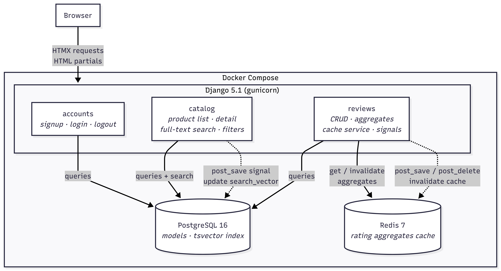

# CloudTalk Review System
## Architecture
I built this with Python (Django) as this is the framework I am most familiar with.
I considered using Golang but I could not guarantee the high quality result as I have just started learning it.

For frontend, I used HTMX. I am a backend engineer,
but I used htmx in the past and this also seems like the simplest option.
For the database I used PostgreSQL.



### Project layout
I have structured the project into several components to keep it simple, extensible and easy to maintain.
It follows the standard Django approach of division into apps where each of them handle specific functionality.
```
config/         The django project (basically configuration files: settings URLs)
apps/
  accounts/     App to manage user accounts. Extremely simple suffices here for our usecase.
  catalog/      App to manage the inventory of products (read only, can be modified using Admin interface)
  reviews/      App to manage the product reviews, aggregate cache service
templates/      Django templates with HTMX partials
```
### Stack

| Layer | Choice |
|---|---|
| Backend | Django 5.1 |
| Database | Postgres 16 |
| Cache | Redis 7 via django-redis |
| Frontend | Django templates + HTMX + Tailwind (CDN) |
| Auth | Django session auth + custom signup |
| Container | docker-compose (web, db, redis) |
| CI | GitHub Actions (ruff + Django tests) |

## Quick start
To run this and add basic demo data please use these commands
```bash
cp .env.example .env
docker compose up -d
docker compose exec web python manage.py seed_demo_data
```

Open [http://localhost:8000](http://localhost:8000). Sign up or use any seeded user (`user0`–`user9`, password: `testpass123`).

## Features

- **Product catalog** with category filtering, minimum-rating filter, and sort (newest / rating / name)
- **Full-text search** powered by Postgres `tsvector` with weighted ranking (name > description)
- **HTMX-driven UI** — filter, sort, search, create, edit, and delete reviews without full page reloads
- **Inline review editing** with update the rating summary
- **Load-more pagination** for reviews
- **One review per user per product** enforced at DB level (`UniqueConstraint`)
- **Cached aggregates** (average rating + count) in Redis, invalidated via Django signals on review save/delete
- **Custom user model** (`AbstractUser` subclass) — safe to extend later without migrations headaches
- **Admin panel** at `/admin/` for all models

## Commands

```bash
# Start / stop
docker compose up -d
docker compose down

# Create superuser (for /admin/)
docker compose exec web python manage.py createsuperuser

# Seed demo data (idempotent with --flush)
docker compose exec web python manage.py seed_demo_data
docker compose exec web python manage.py seed_demo_data --flush

# Run tests
docker compose exec web python manage.py test apps --settings=config.settings.test -v2
```
